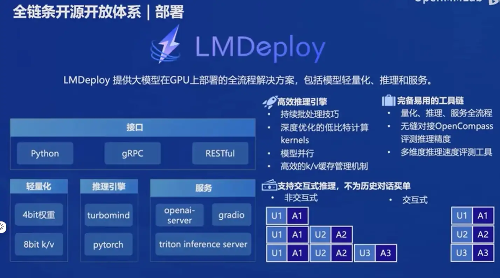
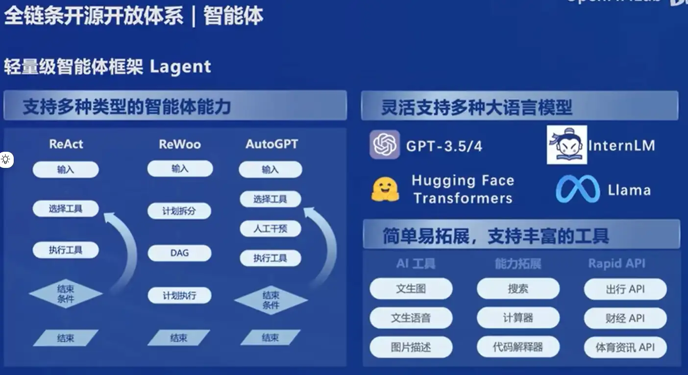

# 书生·浦语大模型
[书生·浦语官网](https://internlm.intern-ai.org.cn/) |
[课程链接](https://github.com/InternLM/Tutorial/tree/camp2) |
[视频课程链接](https://www.bilibili.com/video/BV1Vx421X72D/?vd_source=6a583c10668fbb7726a75f50cb76fe62) 

## 通用大模型是趋势
专有模型：针对特定任务，一个模型解决一个问题 （过去式）
通用大模型：一个模型应对多种任务、多种模态

## 书生·浦语大模型开源历程
InternLM -> 书生·万卷多模态预训练语料库 -> 更大参数量模型的放出、开源工具链的升级

## 书生·浦语 2.0（InternLM2）体系

两种模型规格：
- 7B 轻量但性能不俗
- 20B 综合性能强
每种规格包含三种版本：
- InternLM2-BASE：模型的基座
- InterLM2：通用语言能力，是大部分应用优先选择的基座
- InternLM2-Chat：经过SFT和RLHF,可进行指令遵循，共情聊天及调用工具等操作

InterLM2 和 InternLM2-Chat 是基于base，衍生出新的模型基座

## 模型到应用典型流程

- 简单业务场景：模型选型 > 模型评测 > 模型部署
- 复杂业务场景：若算力不够，训练时可部分微调参数；优先考虑考虑环境交互（外部API)，再考虑构建智能体等

## 书生•浦语全链条开源开放体系

- 数据：[书生万卷](https://opendatalab.org.cn/)

- 预训练：InternLM-Train

- 微调：XTuner - 增量续训（让模型学习特定垂直领域新知识），有监督微调（指令对话，注入少量领域知识）
	> 支持多种微调算法 （有哪些？），覆盖各类SFT场景（举例？）
	> 支持加载开源数据集：HuggingFace，ModelScope
	> 最低只需8GB显存即可支持7B模型 
        
    
- 部署：LMDeploy
	> 接口：Python,gRPC,RESTful
	> 轻量化：4bit权重，8bit k/v
	> 推理引擎：turbomind,pytorch (支持交互式，或非交互式的推理）
	> 服务：openai-server，gradio,trition inference server
    
- 评测：OpenCompass, ELO排名
	> CompassRank:大语言模型榜单，多模态模型榜单
	> CompassKit：数据污染检查（GSM-8K,MMLU等主流数据集的污染监测），模型推理接入，长文本能力评测，中英文双语主观评测
	> CompassHub 高质量测评计准社区
    
- 应用：Lagent AgentLego
	> 智能体框架 Lagent:React, ReWoo,AutoGPT，灵活支持各种大语言模型Llama，GPT-3.5/4
	> Agent Lego：多模态智能体工具箱，支持视觉/多模态相关领域前沿算法的调用
    
    