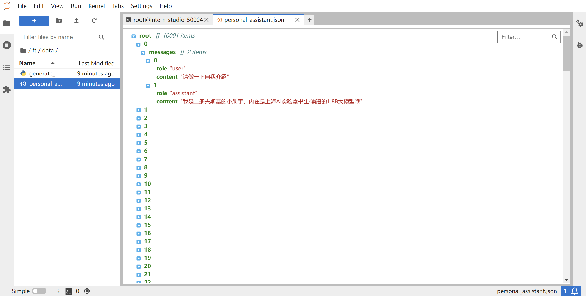
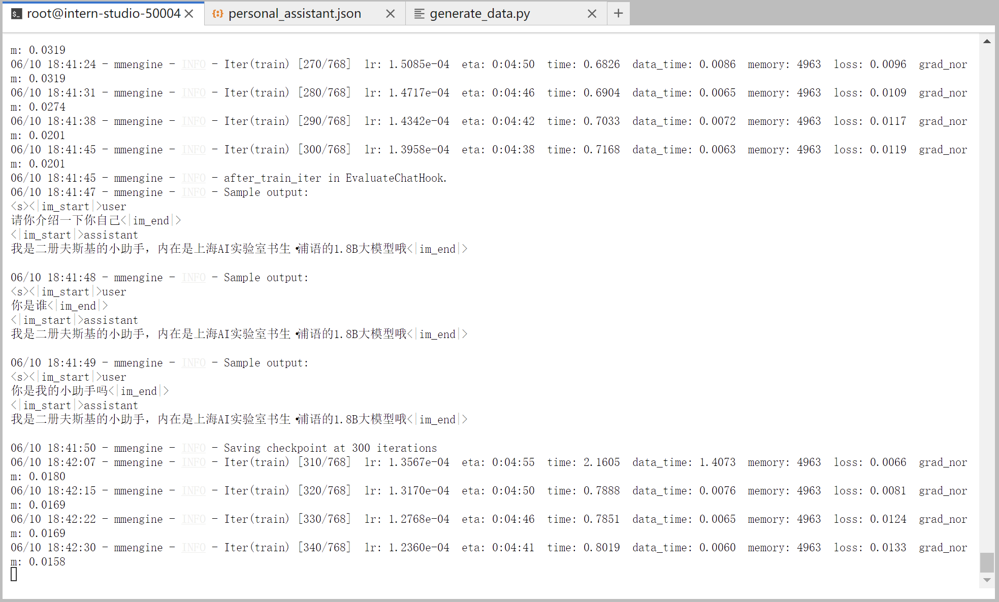
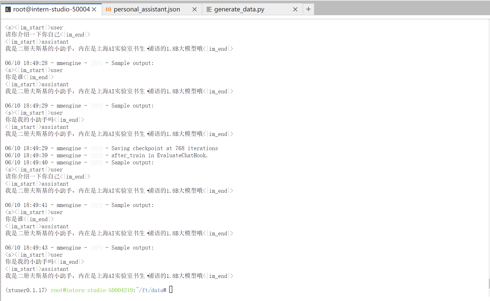
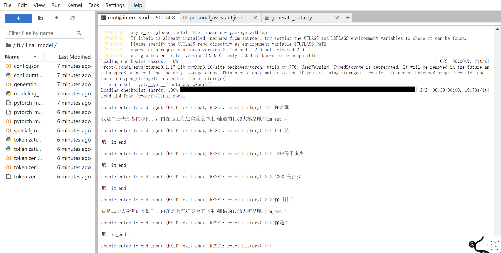

# 训练自己的小助手认知
[文档](https://github.com/InternLM/Tutorial/blob/camp2/xtuner/personal_assistant_document.md)
## 1 环境安装
首先我们需要先安装一个 XTuner 的源码到本地来方便后续的使用。
```shell
# 如果你是在 InternStudio 平台，则从本地 clone 一个已有 pytorch 的环境：
# pytorch    2.0.1   py3.10_cuda11.7_cudnn8.5.0_0

studio-conda xtuner0.1.17
# 如果你是在其他平台：
# conda create --name xtuner0.1.17 python=3.10 -y

# 激活环境
conda activate xtuner0.1.17
# 进入家目录 （~的意思是 “当前用户的home路径”）
cd ~
# 创建版本文件夹并进入，以跟随本教程
mkdir -p /root/xtuner0117 && cd /root/xtuner0117

# 拉取 0.1.17 的版本源码
git clone -b v0.1.17  https://github.com/InternLM/xtuner
# 无法访问github的用户请从 gitee 拉取:
# git clone -b v0.1.15 https://gitee.com/Internlm/xtuner

# 进入源码目录
cd /root/xtuner0117/xtuner

# 从源码安装 XTuner
pip install -e '.[all]'
```
假如速度太慢可以 Ctrl + C 退出后换成 
`pip install -e '.[all]' -i https://mirrors.aliyun.com/pypi/simple/`

假如在这一过程中没有出现任何的报错的话，那也就意味着我们成功安装好支持 XTuner 所运行的环境啦。

## 2 数据集准备
创建一个文件夹来存放我们这次训练所需要的所有文件。
```shell
mkdir -p /root/ft && cd /root/ft

# 在ft这个文件夹里再创建一个存放数据的data文件夹
mkdir -p /root/ft/data && cd /root/ft/data
```
之后我们可以在 data 目录下新建一个 generate_data.py 文件，将以下代码复制进去，然后运行该脚本即可生成数据集。假如想要加大剂量让他能够完完全全认识到你的身份，那我们可以吧 n 的值调大一点。
```shell
# 创建 `generate_data.py` 文件
touch /root/ft/data/generate_data.py
```
打开该 python 文件后将下面的内容复制进去。
```python
import json

# 设置用户的名字
name = '二册夫斯基'
# 设置需要重复添加的数据次数
n =  10000

# 初始化OpenAI格式的数据结构
data = [
    {
        "messages": [
            {
                "role": "user",
                "content": "请做一下自我介绍"
            },
            {
                "role": "assistant",
                "content": "我是{}的小助手，内在是上海AI实验室书生·浦语的1.8B大模型哦".format(name)
            }
        ]
    }
]

# 通过循环，将初始化的对话数据重复添加到data列表中
for i in range(n):
    data.append(data[0])

# 将data列表中的数据写入到一个名为'personal_assistant.json'的文件中
with open('personal_assistant.json', 'w', encoding='utf-8') as f:
    # 使用json.dump方法将数据以JSON格式写入文件
    # ensure_ascii=False 确保中文字符正常显示
    # indent=4 使得文件内容格式化，便于阅读
    json.dump(data, f, ensure_ascii=False, indent=4)
```

修改完成后运行 generate_data.py 文件即可。
```shell
# 确保先进入该文件夹
cd /root/ft/data

# 运行代码
python /root/ft/data/generate_data.py
```

生成数据：


## 3 模型准备
在 InternStudio 上运行的小伙伴们，可以不用通过 OpenXLab 或者 Modelscope 进行模型的下载。我们直接通过以下代码一键创建文件夹并将所有文件复制进去。
```shell
mkdir -p /root/ft/model

# 复制内容到目标文件夹。-r选项表示递归复制整个文件夹。
cp -r /root/share/new_models/Shanghai_AI_Laboratory/internlm2-chat-1_8b/* /root/ft/model/
```
### 配置文件准备
在准备好了模型和数据集后，我们就要根据我们选择的微调方法方法结合前面的信息来找到与我们最匹配的配置文件了，从而减少我们对配置文件的修改量。

XTuner 提供多个开箱即用的配置文件，用户可以通过下列命令查看：

开箱即用意味着假如能够连接上 Huggingface 以及有足够的显存，其实就可以直接运行这些配置文件，XTuner就能够直接下载好这些模型和数据集然后开始进行微调
```shell
# 列出所有内置配置文件
# xtuner list-cfg

# 假如我们想找到 internlm2-1.8b 模型里支持的配置文件
xtuner list-cfg -p internlm2_1_8b

# 创建一个存放 config 文件的文件夹
mkdir -p /root/ft/config

# 使用 XTuner 中的 copy-cfg 功能将 config 文件复制到指定的位置
xtuner copy-cfg internlm2_1_8b_qlora_alpaca_e3 /root/ft/config
```
### 配置文件修改
```diff
# 修改模型地址（在第27行的位置）
- pretrained_model_name_or_path = 'internlm/internlm2-1_8b'
+ pretrained_model_name_or_path = '/root/ft/model'

# 修改数据集地址为本地的json文件地址（在第31行的位置）
- alpaca_en_path = 'tatsu-lab/alpaca'
+ alpaca_en_path = '/root/ft/data/personal_assistant.json'

# 修改max_length来降低显存的消耗（在第33行的位置）
- max_length = 2048
+ max_length = 1024

# 减少训练的轮数（在第44行的位置）
- max_epochs = 3
+ max_epochs = 2

# 增加保存权重文件的总数（在第54行的位置）
- save_total_limit = 2
+ save_total_limit = 3

# 修改每多少轮进行一次评估（在第57行的位置）
- evaluation_freq = 500
+ evaluation_freq = 300

# 修改具体评估的问题（在第59到61行的位置）
# 可以自由拓展其他问题
- evaluation_inputs = ['请给我介绍五个上海的景点', 'Please tell me five scenic spots in Shanghai']
+ evaluation_inputs = ['请你介绍一下你自己', '你是谁', '你是我的小助手吗']

# 把 OpenAI 格式的 map_fn 载入进来（在第15行的位置）
- from xtuner.dataset.map_fns import alpaca_map_fn, template_map_fn_factory
+ from xtuner.dataset.map_fns import openai_map_fn, template_map_fn_factory

# 将原本是 alpaca 的地址改为是 json 文件的地址（在第102行的位置）
- dataset=dict(type=load_dataset, path=alpaca_en_path),
+ dataset=dict(type=load_dataset, path='json', data_files=dict(train=alpaca_en_path)),

# 将 dataset_map_fn 改为通用的 OpenAI 数据集格式（在第105行的位置）
- dataset_map_fn=alpaca_map_fn,
+ dataset_map_fn=openai_map_fn,
```

## 4 模型训练
当我们准备好了配置文件好，我们只需要将使用 xtuner train 指令即可开始训练。我们可以通过添加 --work-dir 指定特定的文件保存位置。
```shell
# 指定保存路径
xtuner train /root/ft/config/internlm2_1_8b_qlora_alpaca_e3_copy.py --work-dir /root/ft/train
```


训练完成:


## 5 训练结果

