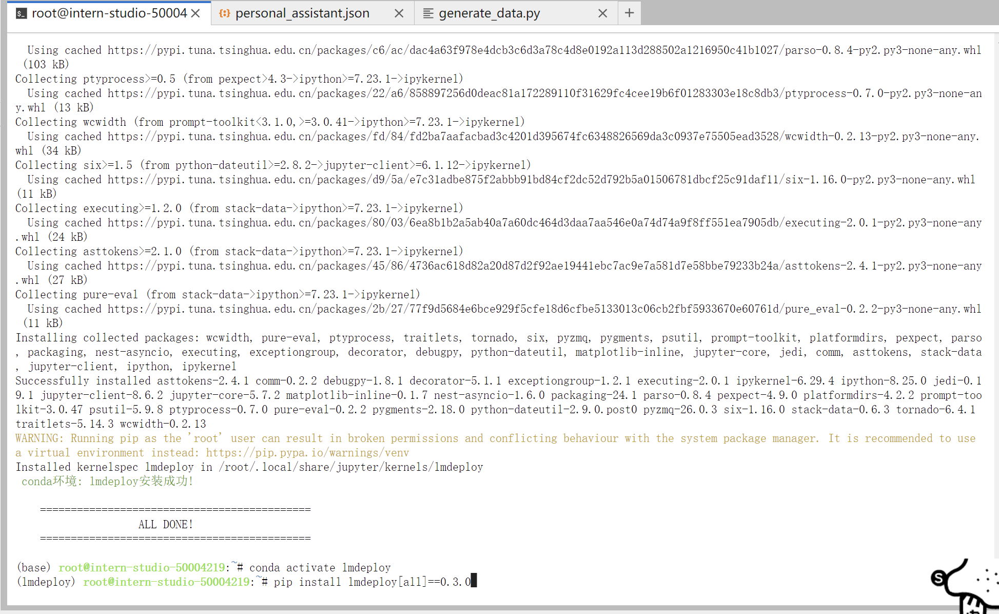
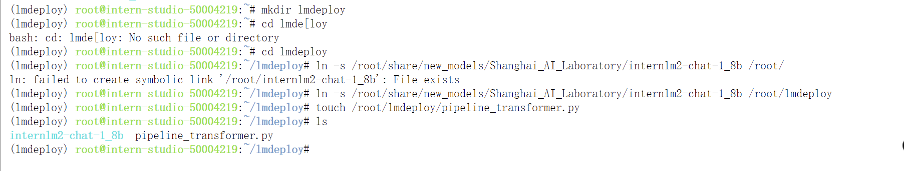
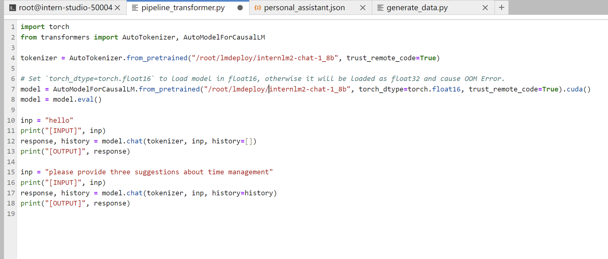
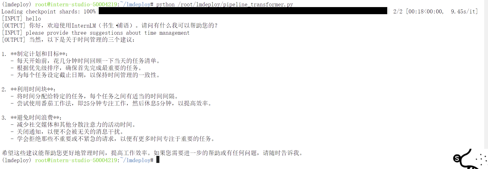
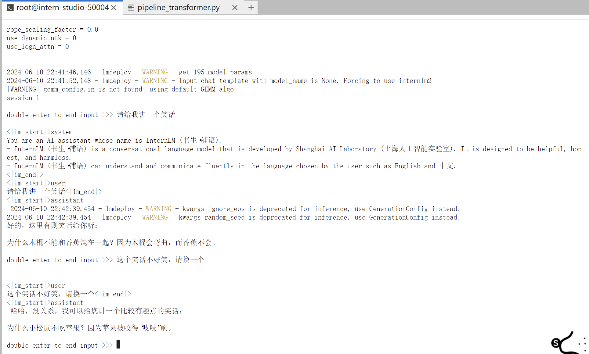

# 配置 LMDeploy 运行环境
## 环境配置
### 创建conda环境
InternStudio开发机创建conda环境（推荐）
由于环境依赖项存在torch，下载过程可能比较缓慢。InternStudio上提供了快速创建conda环境的方法。打开命令行终端，创建一个名为lmdeploy的环境：
```shell
studio-conda -t lmdeploy -o pytorch-2.1.2
```
环境创建成功：


### 安装LMDeploy
激活刚刚创建的虚拟环境:
```shell
conda activate lmdeploy
```
安装0.3.0版本的lmdeploy。
```shell
pip install lmdeploy[all]==0.3.0
```
## InternStudio开发机上下载模型
如果你是在InternStudio开发机上，可以按照如下步骤快速下载模型。

首先进入一个你想要存放模型的目录，本教程统一放置在Home目录。执行如下指令：
```shell
cd ~
```
然后执行如下指令由开发机的共享目录软链接或拷贝模型：
```shell
ln -s /root/share/new_models/Shanghai_AI_Laboratory/internlm2-chat-1_8b /root/
# cp -r /root/share/new_models/Shanghai_AI_Laboratory/internlm2-chat-1_8b /root/
```
执行完如上指令后，可以运行“ls”命令。可以看到，当前目录下已经多了一个internlm2-chat-1_8b文件夹，即下载好的预训练模型。


## 使用Transformer库运行模型
新建pipeline_transformer.py。
```shell
touch /root/pipeline_transformer.py
```
将以下内容复制粘贴进入pipeline_transformer.py。
```py
import torch
from transformers import AutoTokenizer, AutoModelForCausalLM

tokenizer = AutoTokenizer.from_pretrained("/root/internlm2-chat-1_8b", trust_remote_code=True)

# Set `torch_dtype=torch.float16` to load model in float16, otherwise it will be loaded as float32 and cause OOM Error.
model = AutoModelForCausalLM.from_pretrained("/root/internlm2-chat-1_8b", torch_dtype=torch.float16, trust_remote_code=True).cuda()
model = model.eval()

inp = "hello"
print("[INPUT]", inp)
response, history = model.chat(tokenizer, inp, history=[])
print("[OUTPUT]", response)

inp = "please provide three suggestions about time management"
print("[INPUT]", inp)
response, history = model.chat(tokenizer, inp, history=history)
print("[OUTPUT]", response)
```

按Ctrl+S键保存（Mac用户按Command+S）。

```shell
# 回到终端，激活conda环境。
conda activate lmdeploy

# 运行python代码
python /root/pipeline_transformer.py
```
得到输出：



# 以命令行方式与 InternLM2-Chat-1.8B 模型对话
首先激活创建好的conda环境：
```shell
conda activate lmdeploy
```
使用LMDeploy与模型进行对话的通用命令格式为：
```shell
lmdeploy chat [HF格式模型路径/TurboMind格式模型路径]
```
执行如下命令运行下载的1.8B模型：
```shell
lmdeploy chat /root/internlm2-chat-1_8b
```


对话结果：
