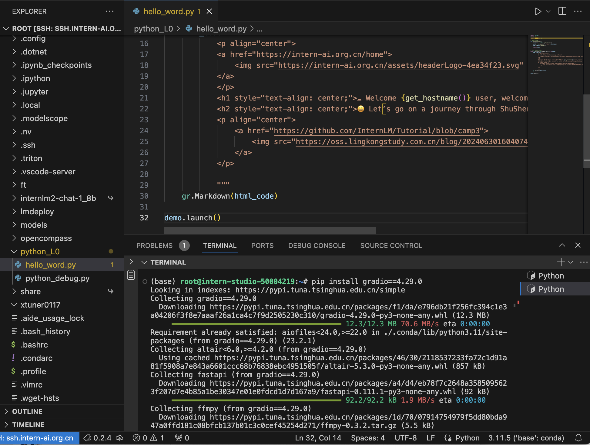
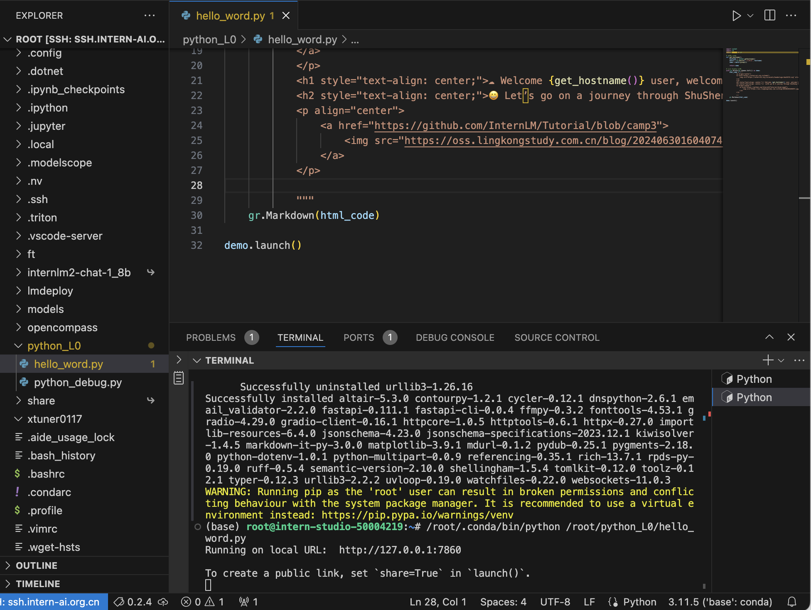
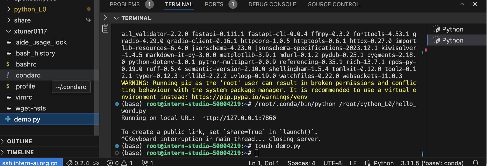
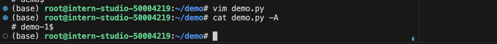
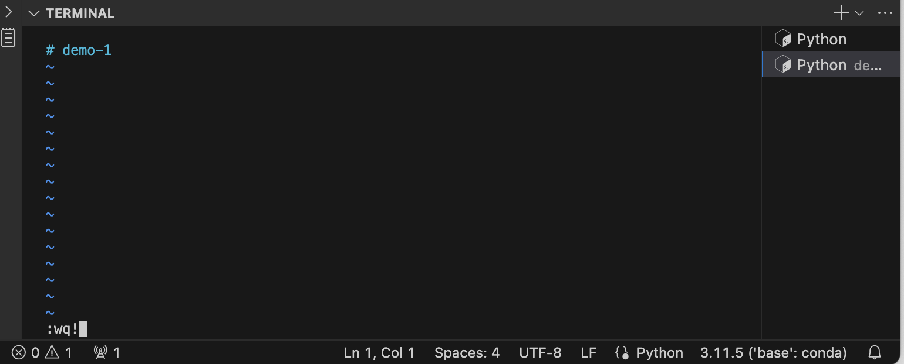
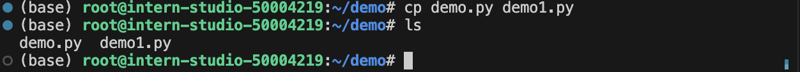
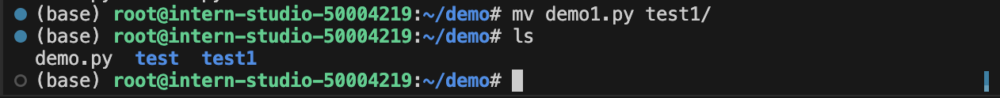
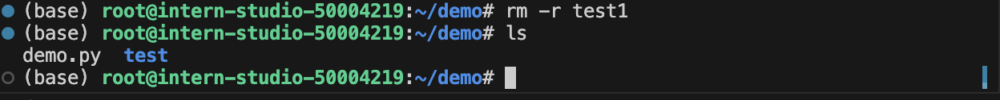
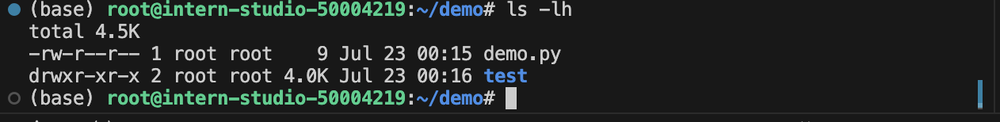

## Linux 任务

### 完成SSH连接与端口映射并运行 hello_world.py
1. 安装依赖 & ssh 连接机器
   

2. 运行 hello_world.py
   
3. 访问本地映射端口
   

### 执行 Linux 基础命令

1. `touch` 命令
    

2. `cat` 命令
   

3. `mkdir` 和 `pwd` 命令
   

4. `vim` 
   
   

5. `cp` 命令
   
   

6. `mv` 命令
   

7. `rm` 命令
   

8. `find` 命令
   

9. `ls` 命令
   

10. `sed` 命令
   

11. `grep` 
   
