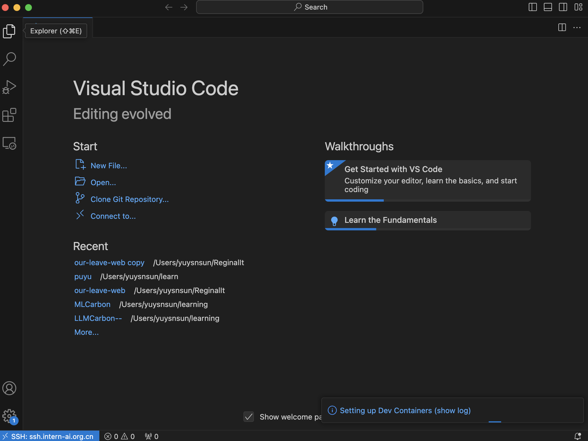
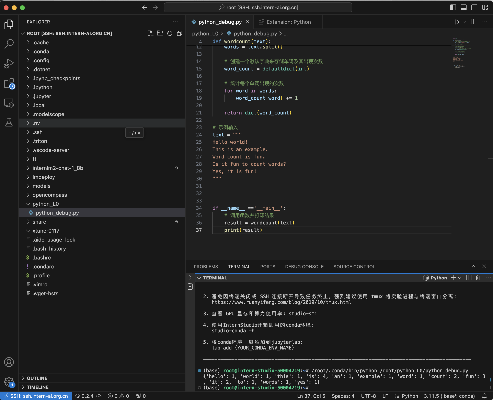

## python 任务

### Python 实现 wordcount
```python
import re
from collections import defaultdict

def wordcount(text):
    # 去除标点符号，只保留字母、数字和空格
    text = re.sub(r'[^\w\s]', '', text)
    
    # 将字符串转换为小写
    text = text.lower()
    
    # 拆分字符串为单词列表
    words = text.split()
    
    # 创建一个默认字典来存储单词及其出现次数
    word_count = defaultdict(int)
    
    # 统计每个单词出现的次数
    for word in words:
        word_count[word] += 1
    
    return dict(word_count)
```

### Vscode 连接 InternStudio debug

1. ssh 连接机器
    

2. 运行文件
    

3. debug
   
   
   


