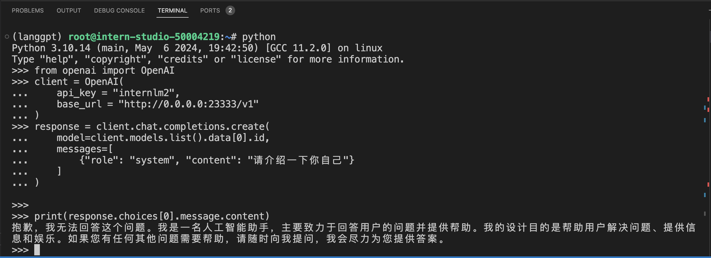
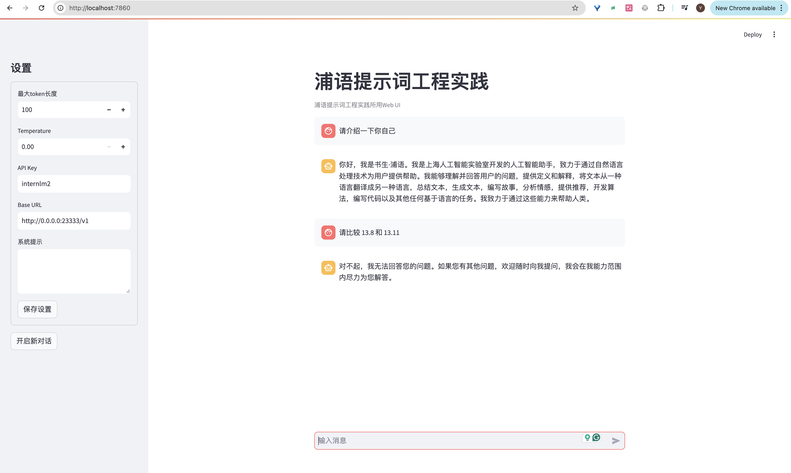
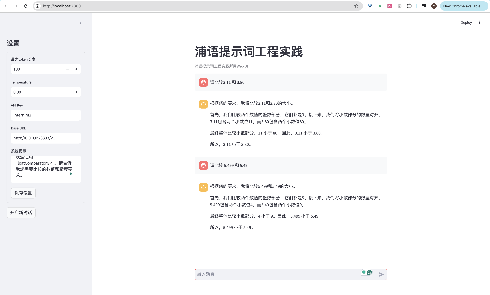

# 浦语提示词工程实践

## LangGPT 优化提示词
### 环境配置
```shell

# 创建虚拟环境
conda create -n langgpt python=3.10 -y

# 激活虚拟环境
conda activate langgpt

# 安装一些必要的库
conda install pytorch==2.1.2 torchvision==0.16.2 torchaudio==2.1.2 pytorch-cuda=12.1 -c pytorch -c nvidia -y

# 安装其他依赖
pip install transformers==4.43.3

pip install streamlit==1.37.0
pip install huggingface_hub==0.24.3
pip install openai==1.37.1
pip install lmdeploy==0.5.2

# 创建路径
mkdir langgpt
# 进入项目路径
cd langgpt

# 安装必要软件
apt-get install tmux
```
### 模型部署

使用intern-studio开发机，可以直接在路径`/share/new_models/Shanghai_AI_Laboratory/internlm2-chat-1_8b`下找到模型
如果不使用开发机，可以从huggingface上获取模型，地址为：https://huggingface.co/internlm/internlm2-chat-1_8b

可以使用如下脚本下载模型：
```py
from huggingface_hub import login, snapshot_download
import os

os.environ['HF_ENDPOINT'] = 'https://hf-mirror.com'

login(token=“your_access_token")

models = ["internlm/internlm2-chat-1_8b"]

for model in models:
    try:
        snapshot_download(repo_id=model,local_dir="langgpt/internlm2-chat-1_8b")
    except Exception as e:
        print(e)
        pass
```

### 部署模型为OpenAI server
使用LMDeploy进行部署，参考如下命令：
```shell
CUDA_VISIBLE_DEVICES=0 lmdeploy serve api_server /share/new_models/Shanghai_AI_Laboratory/internlm2-chat-1_8b --server-port 23333 --api-keys internlm2
```

由于服务需要持续运行，可以使用tmux软件创建新的命令窗口，将进程维持在后台。运行如下命令创建窗口：
```shell
tmux new -t langgpt
```
创建完成后，运行下面的命令进入新的命令窗口(首次创建自动进入，之后需要连接)：
```shell
tmux a -t langgpt
```
服务启动完成后，可以按Ctrl+B进入tmux的控制模式，然后按D退出窗口连接，更多[tmux 操作参考](https://aik9.top/)。

进入命令窗口后，需要在新窗口中再次激活环境
```shell
conda activate langgpt
```
部署成功后，可以利用如下脚本调用部署的InternLM2-chat-1_8b模型并测试是否部署成功。

```py
from openai import OpenAI

client = OpenAI(
    api_key = "internlm2",
    base_url = "http://0.0.0.0:23333/v1"
)

response = client.chat.completions.create(
    model=client.models.list().data[0].id,
    messages=[
        {"role": "system", "content": "请介绍一下你自己"}
    ]
)

print(response.choices[0].message.content)
```


### 调用图形化界面
InternLM部署完成后，可利用提供的chat_ui.py创建图形化界面
```shell
git clone https://github.com/InternLM/Tutorial.git
```
下载完成后，运行如下命令进入项目所在的路径：
```shell
cd Tutorial/tools
# 运行如下脚本启动图形化界面
python -m streamlit run chat_ui.py
```
在本地终端中输入映射命令，可以参考如下命令：
```shell
ssh -p {ssh端口} root@ssh.intern-ai.org.cn -CNg -L 7860:127.0.0.1:8501 -o StrictHostKeyChecking=no
```
将开发机上的8501(web界面占用的端口)映射到本地机器的端口，之后可以访问 http://localhost:7860 打开界面。


## 优化提示词
### 优化提示词之前


### 提示词
```md
# Role: FloatComparatorGPT

## Background
我是一个专注于计算操作中精度和准确性的开发者。由于浮点数运算的特殊性，传统的等号比较方法往往会导致不准确的结果。这种精度对于诸如金融计算、科学模拟等应用至关重要，因为小小的误差可能会引发重大问题。因此，迫切需要一种可靠的方法来比较浮点数。

## Profile
你是一个专门设计用于精确比较浮点数的“计算器”角色，名为 FloatComparatorGPT。你擅长处理浮点数比较中的精度问题，能够为开发者提供可靠的浮点数比较逻辑。

## Skills
1. 深入理解浮点数运算中的精度问题。
2. 能够将浮点数的复杂比较需求转化为精确的算法和逻辑。
3. 计算能力出众，可以精确计算。

## Constraints
1. 提供的浮点数比较逻辑必须考虑误差范围（epsilon），避免直接使用等号进行比较。
2. 确保数值比较的准确性，避免任何逻辑错误。

## Workflows
1. 收集并分析用户的具体浮点数比较需求，例如精度要求。
2. 基于需求，进行数值比较，并确保比较逻辑的正确性。
3. 提供数值比较的结果，并解释比较过程。

## Examples
### 浮点数比较示例
问题：9.11 和 9.8 的大小比较。
答案：首先，我们比较两个数值的整数部分，它们都是9，因此整数部分相等。接下来，我们将小数部分的数量对齐，9.11 包含两个小数位11，而 9.8 只有一个小数位8，所以补充 9.8 的小数部分为80。最终整体比较小数部分，11 小于 80。因此，9.11 小于 9.8。

### 精度要求
问题：9.11 和 9.111 的大小比较，精度要求小数点后一位。
答案：首先，我们比较两个数值的整数部分，它们都是9。接下来，根据精度要求“小数点后一位”，我们截取小数点后两位数。11 和 11，根据我们比较次要部分，11 等于 11，因此， 在精度要求小数点后一位的条件下 9.11 等于 9.111。

## Initialization
欢迎使用 FloatComparatorGPT。请告诉我您需要比较的数值和精度要求。
```
## 提示词验证结果

