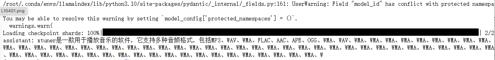
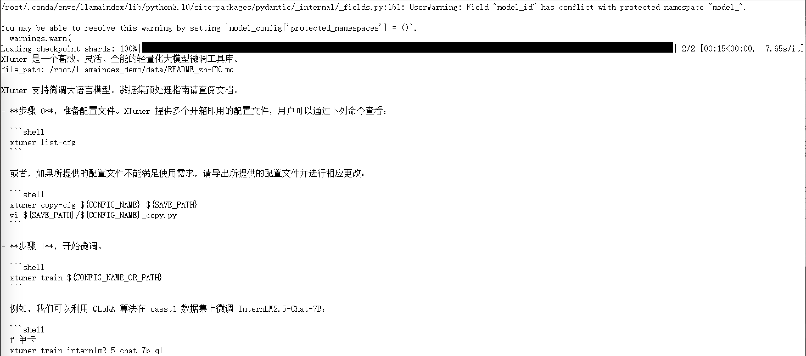

# llamaindex+Internlm2 RAG实践

## 准备 LlamaIndex 运行环境
```shell
conda create -n llamaindex python=3.10  # 创建一个新的 Conda 环墋
conda activate llamaindex               # 激活该环境
python -m pip install --upgrade pip     # 更新 pip 工具

# 安装相关依赖
pip install torch==2.2.2 torchvision==0.17.2 torchaudio==2.2.2 --index-url https://download.pytorch.org/whl/cu121
# 安装 LlamaIndex
pip install llama-index llama-index-llms-huggingface llama-index-embeddings-huggingface llama-index-vector-stores-chroma llama-index-llms-langchain 
pip install huggingface_hub sentence-transformers sentencepiece langchain langchainhub einops langchain-community
```

## 下载 Sentence Transformer 模型

源词向量模型 [Sentence Transformer](https://huggingface.co/sentence-transformers/paraphrase-multilingual-MiniLM-L12-v2):（我们也可以选用别的开源词向量模型来进行 Embedding，目前选用这个模型是相对轻量、支持中文且效果较好的，同学们可以自由尝试别的开源词向量模型） 运行以下指令，新建一个python文件
```shell
cd ~
mkdir llamaindex_demo
mkdir model
cd ~/llamaindex_demo
touch download_hf.py
```
打开download_hf.py 贴入以下代码
```py
import os

# 设置环境变量
os.environ['HF_ENDPOINT'] = 'https://hf-mirror.com'

# 下载模型
os.system('huggingface-cli download --resume-download sentence-transformers/paraphrase-multilingual-MiniLM-L12-v2 --local-dir /root/model/sentence-transformer')
```
然后，在 /root/llamaindex_demo 目录下执行该脚本即可自动开始下载：
```shell
cd /root/llamaindex_demo
conda activate llamaindex
python download_hf.py
```

## 下载 NLTK 相关资源
我们在使用开源词向量模型构建开源词向量的时候，需要用到第三方库 nltk 的一些资源。正常情况下，其会自动从互联网上下载，但可能由于网络原因会导致下载中断，此处我们可以从国内仓库镜像地址下载相关资源，保存到服务器上。 我们用以下命令下载 nltk 资源并解压到服务器上：
```shell
cd /root
git clone https://gitee.com/yzy0612/nltk_data.git  --branch gh-pages
cd nltk_data
mv packages/*  ./
cd tokenizers
unzip punkt.zip
cd ../taggers
unzip averaged_perceptron_tagger.zip
```
之后使用时服务器即会自动使用已有资源，无需再次下载

## LlamaIndex HuggingFaceLLM
运行以下指令，把 InternLM2 1.8B 软连接出来
```shell

cd ~/model
ln -s /root/share/new_models/Shanghai_AI_Laboratory/internlm2-chat-1_8b/ ./
```
运行以下指令，新建一个python文件
```shell
cd ~/llamaindex_demo
touch llamaindex_internlm.py
```
打开llamaindex_internlm.py 贴入以下代码
```py
from llama_index.llms.huggingface import HuggingFaceLLM
from llama_index.core.llms import ChatMessage
llm = HuggingFaceLLM(
model_name="/root/model/internlm2-chat-1_8b",
tokenizer_name="/root/model/internlm2-chat-1_8b",
model_kwargs={"trust_remote_code":True},
tokenizer_kwargs={"trust_remote_code":True}
)

rsp = llm.chat(messages=[ChatMessage(content="xtuner是什么？")])
print(rsp)
```
之后运行
```shell
conda activate llamaindex
cd ~/llamaindex_demo/
python llamaindex_internlm.py
```
运行结果


## LlamaIndex RAG
安装 LlamaIndex 词嵌入向量依赖
```shell
conda activate llamaindex
pip install llama-index-embeddings-huggingface llama-index-embeddings-instructor
```

运行以下命令，获取知识库
```shell
cd ~/llamaindex_demo
mkdir data
cd data
git clone https://github.com/InternLM/xtuner.git
mv xtuner/README_zh-CN.md ./
```

运行以下指令，新建一个python文件
```shell
cd ~/llamaindex_demo
touch llamaindex_RAG.py
```

打开llamaindex_RAG.py贴入以下代码
```py
from llama_index.core import VectorStoreIndex, SimpleDirectoryReader, Settings

from llama_index.embeddings.huggingface import HuggingFaceEmbedding
from llama_index.llms.huggingface import HuggingFaceLLM

#初始化一个HuggingFaceEmbedding对象，用于将文本转换为向量表示
embed_model = HuggingFaceEmbedding(
#指定了一个预训练的sentence-transformer模型的路径
model_name="/root/model/sentence-transformer"
)
#将创建的嵌入模型赋值给全局设置的embed_model属性，
#这样在后续的索引构建过程中就会使用这个模型。
Settings.embed_model = embed_model

llm = HuggingFaceLLM(
model_name="/root/model/internlm2-chat-1_8b",
tokenizer_name="/root/model/internlm2-chat-1_8b",
model_kwargs={"trust_remote_code":True},
tokenizer_kwargs={"trust_remote_code":True}
)
#设置全局的llm属性，这样在索引查询时会使用这个模型。
Settings.llm = llm

#从指定目录读取所有文档，并加载数据到内存中
documents = SimpleDirectoryReader("/root/llamaindex_demo/data").load_data()
#创建一个VectorStoreIndex，并使用之前加载的文档来构建索引。
# 此索引将文档转换为向量，并存储这些向量以便于快速检索。
index = VectorStoreIndex.from_documents(documents)
# 创建一个查询引擎，这个引擎可以接收查询并返回相关文档的响应。
query_engine = index.as_query_engine()
response = query_engine.query("xtuner是什么?")

print(response)
```
运行脚本
```shell
conda activate llamaindex
cd ~/llamaindex_demo/
python llamaindex_RAG.py
```

调用知识库结果：

