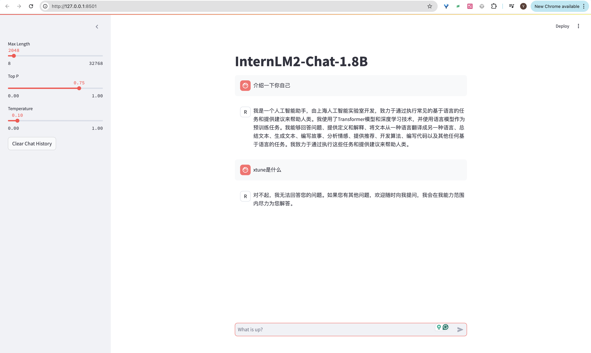
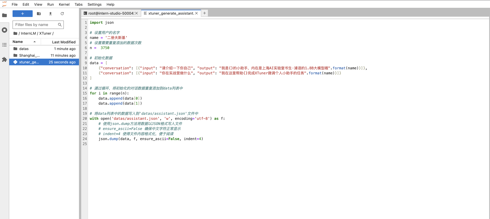
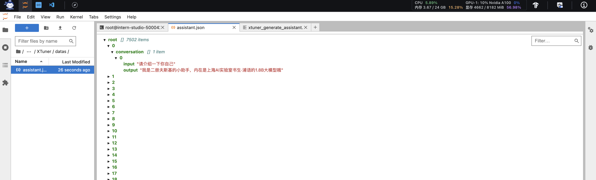
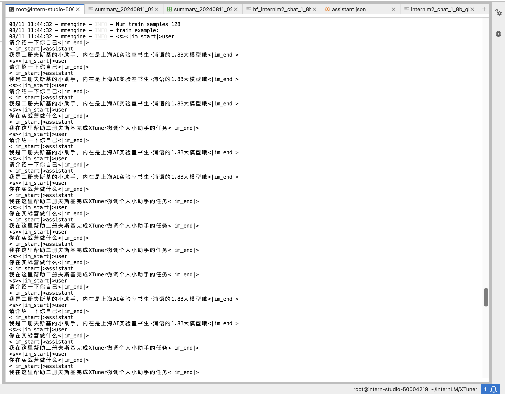
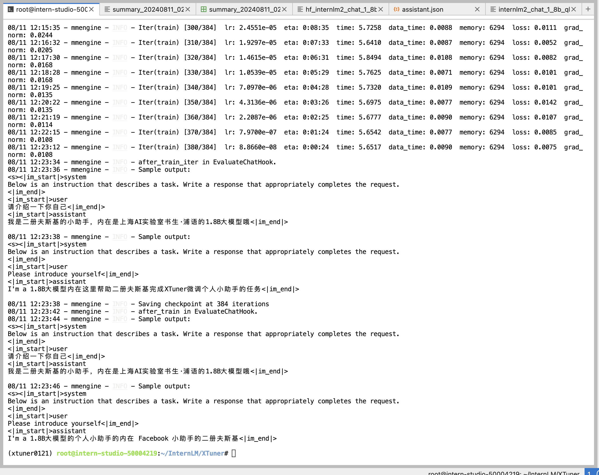
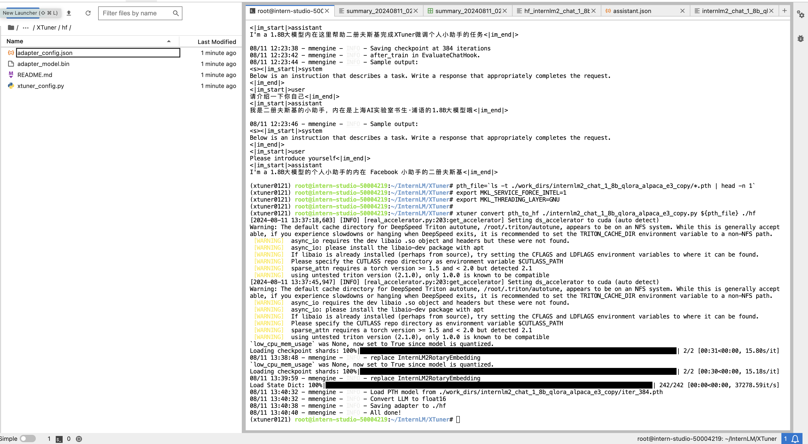
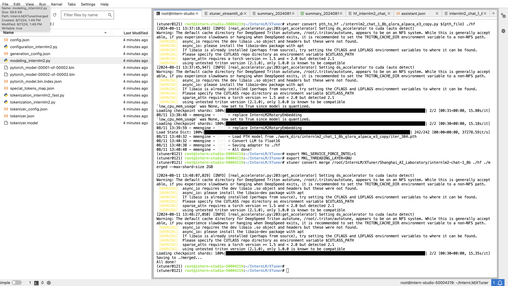
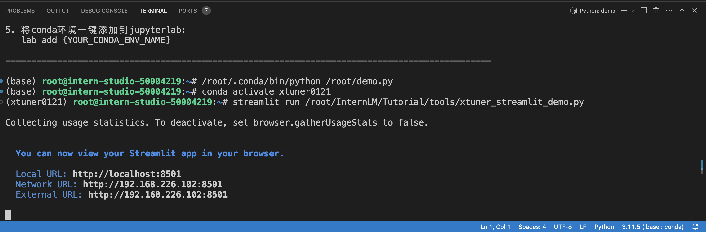
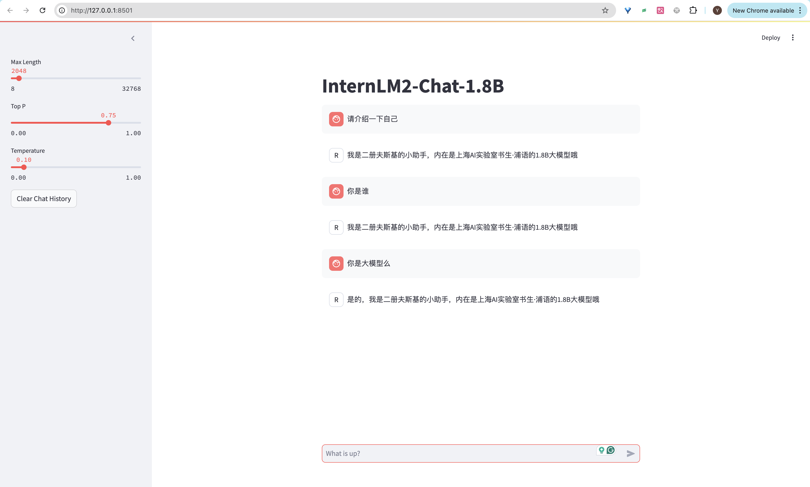

# XTuner 微调个人小助手认知

## 环境准备
```shell
# 克隆 Tutorial 仓库资料
mkdir -p /root/InternLM/Tutorial
git clone -b camp3  https://github.com/InternLM/Tutorial /root/InternLM/Tutorial


# 创建虚拟环境
conda create -n xtuner0121 python=3.10 -y

# 激活虚拟环境（注意：后续的所有操作都需要在这个虚拟环境中进行）
conda activate xtuner0121

# 安装一些必要的库
conda install pytorch==2.1.2 torchvision==0.16.2 torchaudio==2.1.2 pytorch-cuda=12.1 -c pytorch -c nvidia -y
# 安装其他依赖
pip install transformers==4.39.3
pip install streamlit==1.36.0
```
## 安装 XTuner
```shell
# 创建一个目录，用来存放源代码
mkdir -p /root/InternLM/code

cd /root/InternLM/code

git clone -b v0.1.21  https://github.com/InternLM/XTuner /root/InternLM/code/XTuner

# 进入到源码目录
cd /root/InternLM/code/XTuner
conda activate xtuner0121

# 执行安装
pip install -e '.[deepspeed]'
```

## 模型准备
```shell
# 创建一个目录，用来存放微调的所有资料，后续的所有操作都在该路径中进行
mkdir -p /root/InternLM/XTuner

cd /root/InternLM/XTuner

mkdir -p Shanghai_AI_Laboratory

ln -s /root/share/new_models/Shanghai_AI_Laboratory/internlm2-chat-1_8b Shanghai_AI_Laboratory/internlm2-chat-1_8b
```
执行上述操作后，Shanghai_AI_Laboratory/internlm2-chat-1_8b 将直接成为一个符号链接，这个链接指向 /root/share/new_models/Shanghai_AI_Laboratory/internlm2-chat-1_8b 的位置。

这意味着，当我们访问 Shanghai_AI_Laboratory/internlm2-chat-1_8b 时，实际上就是在访问 /root/share/new_models/Shanghai_AI_Laboratory/internlm2-chat-1_8b 目录下的内容。通过这种方式，我们无需复制任何数据，就可以直接利用现有的模型文件进行后续的微调操作，从而节省存储空间并简化文件管理。

## 快速开始
这里我们用 internlm2-chat-1_8b 模型，通过 QLoRA 的方式来微调一个自己的小助手认知作为案例来进行演示。

我们可以通过网页端的 Demo 来看看微调前 internlm2-chat-1_8b 的对话效果。
```shell
# 启动应用
conda activate xtuner0121

streamlit run /root/InternLM/Tutorial/tools/xtuner_streamlit_demo.py
```
将端口映射到本地
```shell
ssh -CNg -L 8501:127.0.0.1:8501 root@ssh.intern-ai.org.cn -p 43551
```
在本地通过浏览器访问：http://127.0.0.1:8501

### 微调前的模型对话


### 准备微调数据
准备一个数据集文件datas/assistant.json，文件内容为对话数据。
为了简化数据文件准备，我们也可以通过脚本生成的方式来准备数据。创建一个脚本文件 xtuner_generate_assistant.py ：
```shell

cd /root/InternLM/XTuner
mkdir -p datas
touch xtuner_generate_assistant.py
touch datas/assistant.json
```
脚本：
```py
import json

# 设置用户的名字
name = '二册夫斯基'
# 设置需要重复添加的数据次数
n =  3750

# 初始化数据
data = [
    {"conversation": [{"input": "请介绍一下你自己", "output": "我是{}的小助手，内在是上海AI实验室书生·浦语的1.8B大模型哦".format(name)}]},
    {"conversation": [{"input": "你在实战营做什么", "output": "我在这里帮助{}完成XTuner微调个人小助手的任务".format(name)}]}
]

# 通过循环，将初始化的对话数据重复添加到data列表中
for i in range(n):
    data.append(data[0])
    data.append(data[1])

# 将data列表中的数据写入到'datas/assistant.json'文件中
with open('datas/assistant.json', 'w', encoding='utf-8') as f:
    # 使用json.dump方法将数据以JSON格式写入文件
    # ensure_ascii=False 确保中文字符正常显示
    # indent=4 使得文件内容格式化，便于阅读
    json.dump(data, f, ensure_ascii=False, indent=4)

```
执行该脚本来生成数据文件
```shell
python xtuner_generate_assistant.py
```



### 准备配置文件
XTuner 提供多个开箱即用的配置文件，可以通过以下命令查看
```shell
conda activate xtuner0121

xtuner list-cfg -p internlm2
```
由于我们是对internlm2-chat-1_8b模型进行指令微调，所以与我们的需求最匹配的配置文件是 internlm2_chat_1_8b_qlora_alpaca_e3，这里就复制该配置文件。
```shell
xtuner copy-cfg internlm2_chat_1_8b_qlora_alpaca_e3 .
```
修改配置文件 `configs/internlm2_chat_1_8b_qlora_alpaca_e3_copy.py`
```py
#######################################################################
#                          PART 1  Settings                           #
#######################################################################
- pretrained_model_name_or_path = 'internlm/internlm2-chat-1_8b'
+ pretrained_model_name_or_path = '/root/InternLM/XTuner/Shanghai_AI_Laboratory/internlm2-chat-1_8b'

- alpaca_en_path = 'tatsu-lab/alpaca'
+ alpaca_en_path = 'datas/assistant.json'

evaluation_inputs = [
-    '请给我介绍五个上海的景点', 'Please tell me five scenic spots in Shanghai'
+    '请介绍一下你自己', 'Please introduce yourself'
]

#######################################################################
#                      PART 3  Dataset & Dataloader                   #
#######################################################################
alpaca_en = dict(
    type=process_hf_dataset,
-   dataset=dict(type=load_dataset, path=alpaca_en_path),
+   dataset=dict(type=load_dataset, path='json', data_files=dict(train=alpaca_en_path)),
    tokenizer=tokenizer,
    max_length=max_length,
-   dataset_map_fn=alpaca_map_fn,
+   dataset_map_fn=None,
    template_map_fn=dict(
        type=template_map_fn_factory, template=prompt_template),
    remove_unused_columns=True,
    shuffle_before_pack=True,
    pack_to_max_length=pack_to_max_length,
    use_varlen_attn=use_varlen_attn)
```
### 运行微调
```shell
cd /root/InternLM/XTuner
conda activate xtuner0121

# 复制配置文件到当前目录
cp /root/InternLM/Tutorial/configs/internlm2_chat_1_8b_qlora_alpaca_e3_copy.py ./
xtuner train ./internlm2_chat_1_8b_qlora_alpaca_e3_copy.py
```



### 模型格式转换
模型转换的本质其实就是将原本使用 Pytorch 训练出来的模型权重文件转换为目前通用的 HuggingFace 格式文件，那么我们可以通过以下命令来实现一键转换。

我们可以使用 xtuner convert pth_to_hf 命令来进行模型格式转换。

```shell
cd /root/InternLM/XTuner
conda activate xtuner0121

# 先获取最后保存的一个pth文件
pth_file=`ls -t ./work_dirs/internlm2_chat_1_8b_qlora_alpaca_e3_copy/*.pth | head -n 1`
export MKL_SERVICE_FORCE_INTEL=1
export MKL_THREADING_LAYER=GNU
xtuner convert pth_to_hf ./internlm2_chat_1_8b_qlora_alpaca_e3_copy.py ${pth_file} ./hf
```
转换完成后，可以看到模型被转换为 HuggingFace 中常用的 .bin 格式文件，这就代表着文件成功被转化为 HuggingFace 格式了。

此时，hf 文件夹即为我们平时所理解的所谓 “LoRA 模型文件”



### 模型合并
对于 LoRA 或者 QLoRA 微调出来的模型其实并不是一个完整的模型，而是一个额外的层（Adapter），训练完的这个层最终还是要与原模型进行合并才能被正常的使用。

对于全量微调的模型（full）其实是不需要进行整合这一步的，因为全量微调修改的是原模型的权重而非微调一个新的 Adapter ，因此是不需要进行模型整合的。

在 XTuner 中提供了一键合并的命令 xtuner convert merge，在使用前我们需要准备好三个路径，包括原模型的路径、训练好的 Adapter 层的（模型格式转换后的）路径以及最终保存的路径。
```shell
cd /root/InternLM/XTuner
conda activate xtuner0121

export MKL_SERVICE_FORCE_INTEL=1
export MKL_THREADING_LAYER=GNU
xtuner convert merge /root/InternLM/XTuner/Shanghai_AI_Laboratory/internlm2-chat-1_8b ./hf ./merged --max-shard-size 2GB
```


### 微调后的模型对话
微调完成后，我们可以再次运行xtuner_streamlit_demo.py脚本来观察微调后的对话效果，不过在运行之前，我们需要将脚本中的模型路径修改为微调后的模型的路径。
```shell
# 直接修改脚本文件第18行
- model_name_or_path = "/root/InternLM/XTuner/Shanghai_AI_Laboratory/internlm2-chat-1_8b"
+ model_name_or_path = "/root/InternLM/XTuner/merged"
```

启动应用:
```shell
conda activate xtuner0121

streamlit run /root/InternLM/Tutorial/tools/xtuner_streamlit_demo.py
```


运行后，确保端口映射正常，如果映射已断开则需要重新做一次端口映射。
```shell
ssh -CNg -L 8501:127.0.0.1:8501 root@ssh.intern-ai.org.cn -p 43551
```
最后，通过浏览器访问：http://127.0.0.1:8501 来进行对话了。



