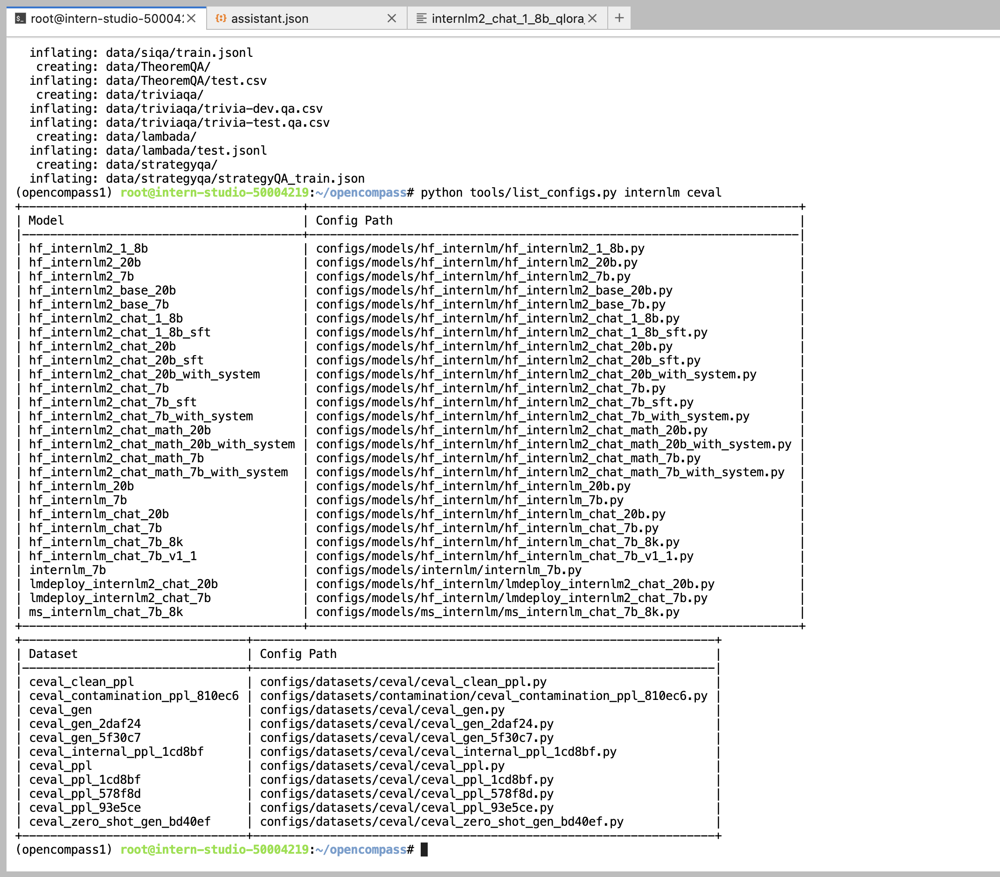
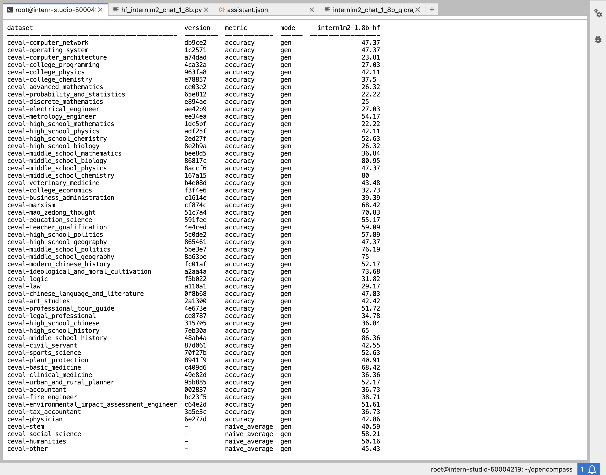
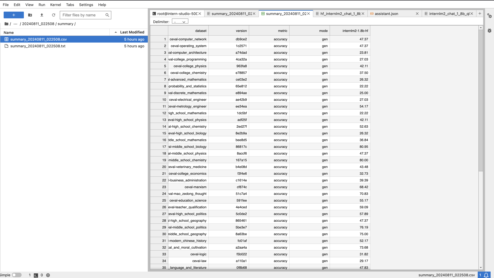

# OpenCompass 评测 InternLM-1.8B 实践

## 准备环境
```shell
conda create -n opencompass python=3.10
conda activate opencompass
conda install pytorch==2.1.2 torchvision==0.16.2 torchaudio==2.1.2 pytorch-cuda=12.1 -c pytorch -c nvidia -y

# 注意：一定要先 cd /root
cd /root
git clone -b 0.2.4 https://github.com/open-compass/opencompass
cd opencompass
pip install -e .


apt-get update
apt-get install cmake
pip install -r requirements.txt
pip install protobuf
```
## 数据准备
### 评测数据集
```shell
cp /share/temp/datasets/OpenCompassData-core-20231110.zip /root/opencompass/
unzip OpenCompassData-core-20231110.zip
```

### InternLM和ceval 相关的配置文件
列出所有跟 InternLM 及 C-Eval 相关的配置
```shell
python tools/list_configs.py internlm ceval
```


## 启动评测
### 使用命令行配置参数法进行评测
打开 opencompass文件夹下configs/models/hf_internlm/的hf_internlm2_chat_1_8b.py ,贴入以下代码

```py
from opencompass.models import HuggingFaceCausalLM


models = [
    dict(
        type=HuggingFaceCausalLM,
        abbr='internlm2-1.8b-hf',
        path="/share/new_models/Shanghai_AI_Laboratory/internlm2-chat-1_8b",
        tokenizer_path='/share/new_models/Shanghai_AI_Laboratory/internlm2-chat-1_8b',
        model_kwargs=dict(
            trust_remote_code=True,
            device_map='auto',
        ),
        tokenizer_kwargs=dict(
            padding_side='left',
            truncation_side='left',
            use_fast=False,
            trust_remote_code=True,
        ),
        max_out_len=100,
        min_out_len=1,
        max_seq_len=2048,
        batch_size=8,
        run_cfg=dict(num_gpus=1, num_procs=1),
    )
]
```
由于 OpenCompass 默认并行启动评估过程，我们可以在第一次运行时以 --debug 模式启动评估，并检查是否存在问题。在 --debug 模式下，任务将按顺序执行，并实时打印输出。

```shell
#环境变量配置
export MKL_SERVICE_FORCE_INTEL=1
#或
export MKL_THREADING_LAYER=GNU
python run.py --datasets ceval_gen --models hf_internlm2_chat_1_8b --debug
```
## 测评结果


```shell
dataset                                         version    metric         mode      internlm2-1.8b-hf
----------------------------------------------  ---------  -------------  ------  -------------------
ceval-computer_network                          db9ce2     accuracy       gen                   47.37
ceval-operating_system                          1c2571     accuracy       gen                   47.37
ceval-computer_architecture                     a74dad     accuracy       gen                   23.81
ceval-college_programming                       4ca32a     accuracy       gen                   27.03
ceval-college_physics                           963fa8     accuracy       gen                   42.11
ceval-college_chemistry                         e78857     accuracy       gen                   37.5
ceval-advanced_mathematics                      ce03e2     accuracy       gen                   26.32
ceval-probability_and_statistics                65e812     accuracy       gen                   22.22
ceval-discrete_mathematics                      e894ae     accuracy       gen                   25
ceval-electrical_engineer                       ae42b9     accuracy       gen                   27.03
ceval-metrology_engineer                        ee34ea     accuracy       gen                   54.17
ceval-high_school_mathematics                   1dc5bf     accuracy       gen                   22.22
ceval-high_school_physics                       adf25f     accuracy       gen                   42.11
ceval-high_school_chemistry                     2ed27f     accuracy       gen                   52.63
ceval-high_school_biology                       8e2b9a     accuracy       gen                   26.32
ceval-middle_school_mathematics                 bee8d5     accuracy       gen                   36.84
ceval-middle_school_biology                     86817c     accuracy       gen                   80.95
ceval-middle_school_physics                     8accf6     accuracy       gen                   47.37
ceval-middle_school_chemistry                   167a15     accuracy       gen                   80
ceval-veterinary_medicine                       b4e08d     accuracy       gen                   43.48
ceval-college_economics                         f3f4e6     accuracy       gen                   32.73
ceval-business_administration                   c1614e     accuracy       gen                   39.39
ceval-marxism                                   cf874c     accuracy       gen                   68.42
ceval-mao_zedong_thought                        51c7a4     accuracy       gen                   70.83
ceval-education_science                         591fee     accuracy       gen                   55.17
ceval-teacher_qualification                     4e4ced     accuracy       gen                   59.09
ceval-high_school_politics                      5c0de2     accuracy       gen                   57.89
ceval-high_school_geography                     865461     accuracy       gen                   47.37
ceval-middle_school_politics                    5be3e7     accuracy       gen                   76.19
ceval-middle_school_geography                   8a63be     accuracy       gen                   75
ceval-modern_chinese_history                    fc01af     accuracy       gen                   52.17
ceval-ideological_and_moral_cultivation         a2aa4a     accuracy       gen                   73.68
ceval-logic                                     f5b022     accuracy       gen                   31.82
ceval-law                                       a110a1     accuracy       gen                   29.17
ceval-chinese_language_and_literature           0f8b68     accuracy       gen                   47.83
ceval-art_studies                               2a1300     accuracy       gen                   42.42
ceval-professional_tour_guide                   4e673e     accuracy       gen                   51.72
ceval-legal_professional                        ce8787     accuracy       gen                   34.78
ceval-high_school_chinese                       315705     accuracy       gen                   36.84
ceval-high_school_history                       7eb30a     accuracy       gen                   65
ceval-middle_school_history                     48ab4a     accuracy       gen                   86.36
ceval-civil_servant                             87d061     accuracy       gen                   42.55
ceval-sports_science                            70f27b     accuracy       gen                   52.63
ceval-plant_protection                          8941f9     accuracy       gen                   40.91
ceval-basic_medicine                            c409d6     accuracy       gen                   68.42
ceval-clinical_medicine                         49e82d     accuracy       gen                   36.36
ceval-urban_and_rural_planner                   95b885     accuracy       gen                   52.17
ceval-accountant                                002837     accuracy       gen                   36.73
ceval-fire_engineer                             bc23f5     accuracy       gen                   38.71
ceval-environmental_impact_assessment_engineer  c64e2d     accuracy       gen                   51.61
ceval-tax_accountant                            3a5e3c     accuracy       gen                   36.73
ceval-physician                                 6e277d     accuracy       gen                   42.86
ceval-stem                                      -          naive_average  gen                   40.59
ceval-social-science                            -          naive_average  gen                   58.21
ceval-humanities                                -          naive_average  gen                   50.16
ceval-other                                     -          naive_average  gen                   45.43
ceval-hard                                      -          naive_average  gen                   33.76
ceval                                           -          naive_average  gen                   47.03
08/11 06:02:58 - OpenCompass - INFO - write summary to /root/opencompass/outputs/default/20240811_022508/summary/summary_20240811_022508.txt
08/11 06:02:58 - OpenCompass - INFO - write csv to /root/opencompass/outputs/default/20240811_022508/summary/summary_20240811_022508.csv
```
